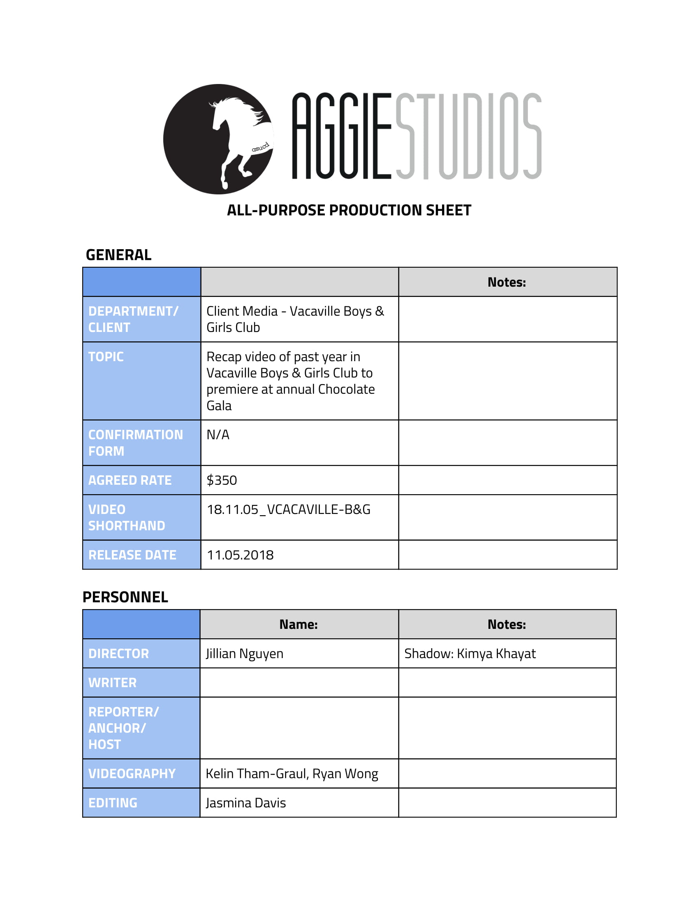
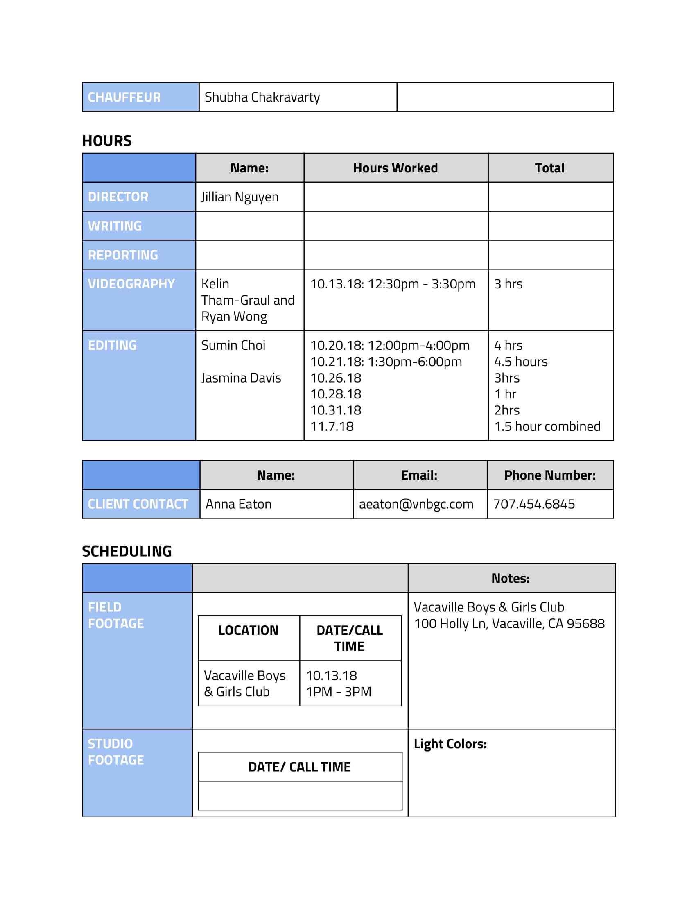
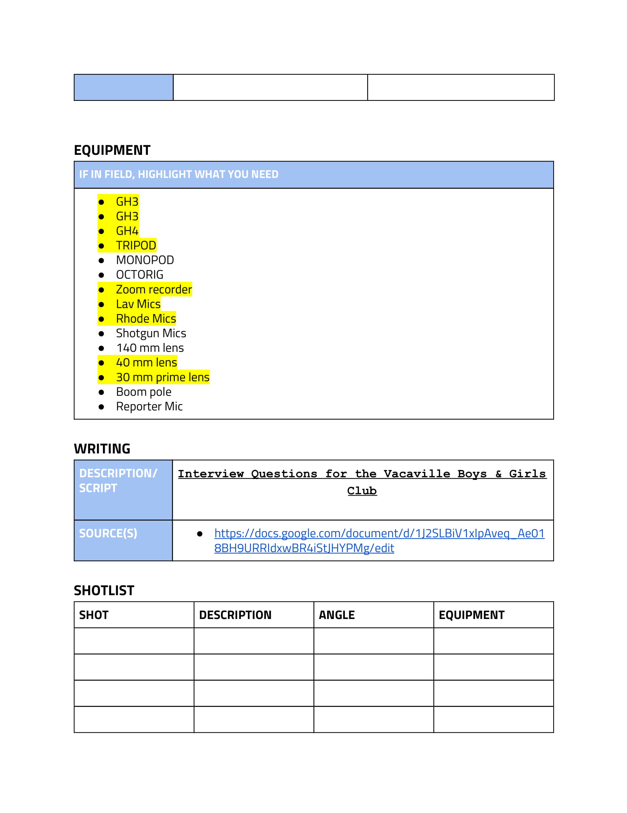
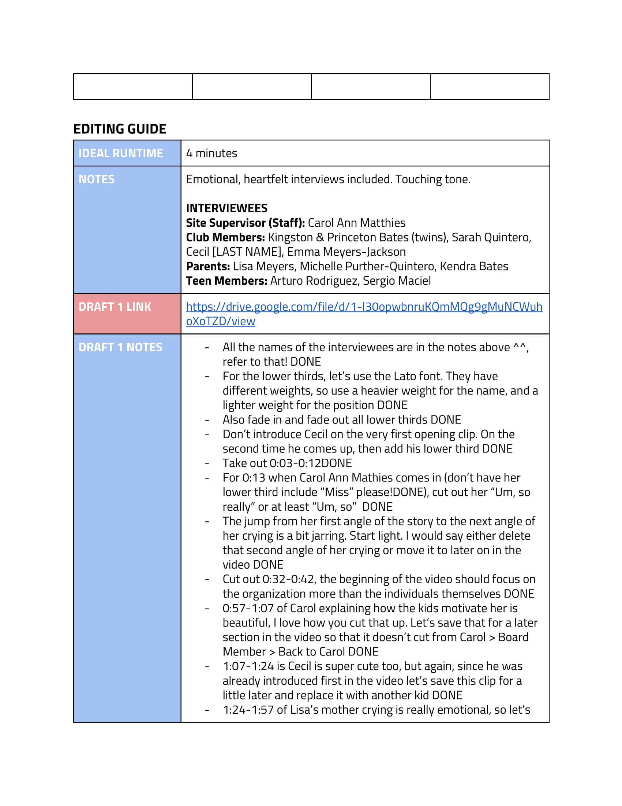
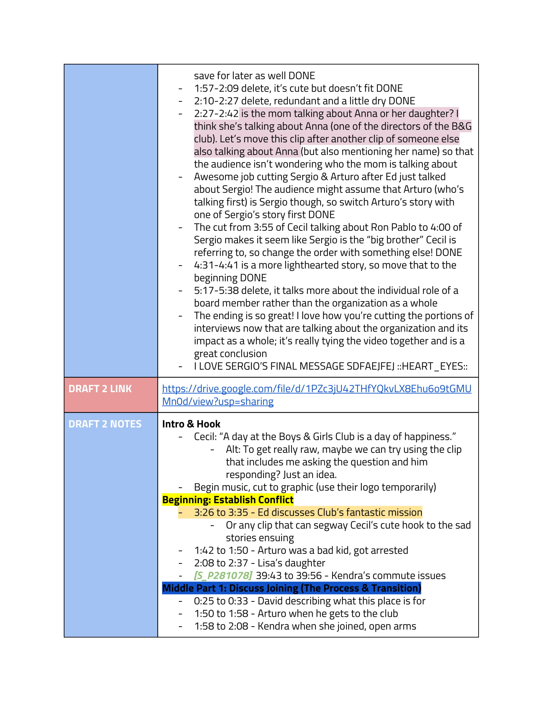
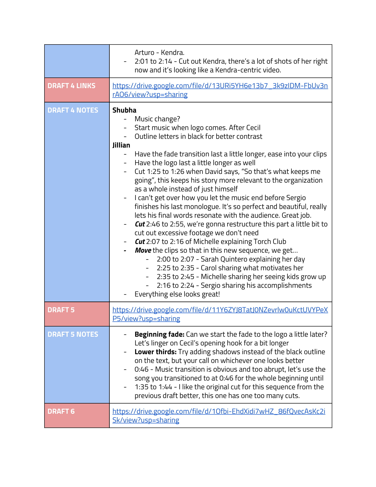
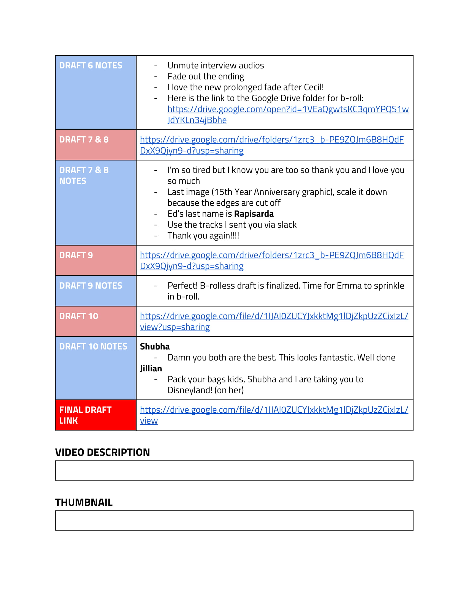

+++
    #this is the "front matter" of the template of a project. It's the variables associated with the file
    #this portion is written in TOML (Tom's Obvious Minimal Language)
    
    title = "Vacaville Boys & Girls Club"
    #replace takes the filename and replaces all hyphens with spaces so that when it appears on your page, it's using spaces. The filename is used in the URL and URLs can't have spaces so use hyphen in the filename.
    #title converts to title-case (using capital letters for principal words only)
    
    date = 2019-05-19T17:02:23-07:00 #the date the file was created
    
    shortDescription = "Recap educating prospective donors on the Vacaville Boys & Girls Club"
    projectVideo = "1Qec3AANQ7QpgV0hNPeenP7kAq7igGJIz"
    #Project video is just the unique part of the URL  
    # For example, if the link is https://vimeo.com/285189099 then the unique part is  285189099
    projectVideoType = "gdrive"
    #Enter "youtube" or "vimeo". You can add other video types as well by editing single.html 
    projectImage = "Vacaville.png"
    #Enter the filename only. For example, "metropolis_album.jpg" 
    #This image should be saved in the project folder with the name of your project 
    projectImageAltText = "Pantry Benefit thumbnail"
    #Alt text is the text that gets read by screenreaders for accessibility (typically for the visually impaired) 

+++

<h2 class="section-title">About the Project</h2>

Vacaville Boys & Girls Club is a video shown at the annual Vacaville Boys & Girls Club Chocolate Gala. This video shared several anecdotes of parents, children, and staff members of the Boys & Girls Club for prospective donors to hear.

 
<h2 class="section-title">The Works</h2>
    
This project was my first one ever as Client Media Director of Aggie Studios. I was not only learning the ropes of my own position, but also tying and knotting new ones as I essentially co-crafted this brand new department with the studio's restructure. While this seems like your average b-roll and interviews layout, there was a lot of work that went in behind the scenes to get to this final product. Ten drafts, to be exact. Probably more.
    
I prepped beforehand with tons of research on the organization before jotting up some questions to ask. Even with a list of pre-made questions, I knew I wanted all the interviews to be colloquial, fluid, and human. That's why I saw the questions as a rough starting guide for these conversations to flourish, rather than a script I had to go through as an interviewer.

        

                <figure class="pp-gallery-item">
                    
                    
                </figure>
        

    
The interviews themselves were amazing, and my appreciation for the altruism and compassion of this organization has infinitely grown. I heard so many stories from struggling parents, to eager students, to the older mentors of the organization that have surpassed their adversities and continue to grow as intelligent young leaders. We wouldn't have been able to do these stories justice by haphazardly chopping them up and tossing music over the whole thing. So those ten drafts I was talking about?

        

                <figure class="pp-gallery-item">
                    
                    
                    
                    
                    
                    
                    
                    
                </figure>
        

    
Yeah, those weren't an exaggeration. As tough as I am on our editors, my priority is always also to keep their morale high. I don't necessarily always sugarcoat, but I do give credit when it's due. Our team has amazing grit and tenacity. And for a first Client Media project, I think it definitely shines through.
    

    

<!-- a new line in markdown will not be displayed in the browser.
\
\
\ 
the lines above this line showed up because they started with backslash (NOT A NORMAL SLASH) \
*here's some "emphasized" text, which defaults to italics but you can make it anythign you want in css*
**here's some "strong" text, which defaults to bold but you can make it anything you want in css**

Below is a list
* asterisks make bullets
- hyphens make bullets
+ plusses make bullets
* you can choose! -->
